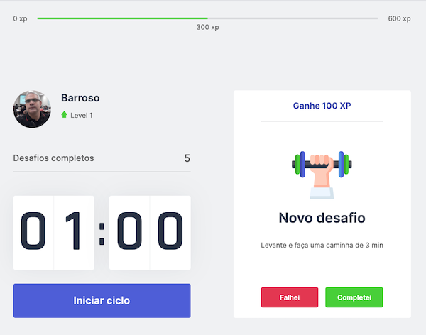

# Base Project

[`NLW#4 - Trilha ReactJS – Próximo nível com React`](https://nextlevelweek.com/)

This is a [Next.js](https://nextjs.org/) project bootstrapped with [`create-next-app`](https://github.com/vercel/next.js/tree/canary/packages/create-next-app).



## Getting Started

Add packages

```bash
yarn install
```

run the development server:

```bash
yarn dev
```

## Learn More

To learn more about Next.js, take a look at the following resources:

- [Next.js Documentation](https://nextjs.org/docs) - learn about Next.js features and API.
- [Learn Next.js](https://nextjs.org/learn) - an interactive Next.js tutorial.

You can check out [the Next.js GitHub repository](https://github.com/vercel/next.js/) - your feedback and contributions are welcome!

## References

- [React](https://pt-br.reactjs.org/)
  - [State Hook](https://pt-br.reactjs.org/docs/hooks-state.html)
  - [Effect Hook](https://pt-br.reactjs.org/docs/hooks-effect.html)
  - [Context](https://pt-br.reactjs.org/docs/context.html)

- CSS
  - [Grid Layout](https://developer.mozilla.org/pt-BR/docs/Web/CSS/CSS_Grid_Layout/Basic_Concepts_of_Grid_Layout)
  - [Custom Property / var](https://developer.mozilla.org/pt-BR/docs/Web/CSS/var())
  - [Transform Function](https://developer.mozilla.org/en-US/docs/Web/CSS/transform-function/translateX)

Is this page useful?
